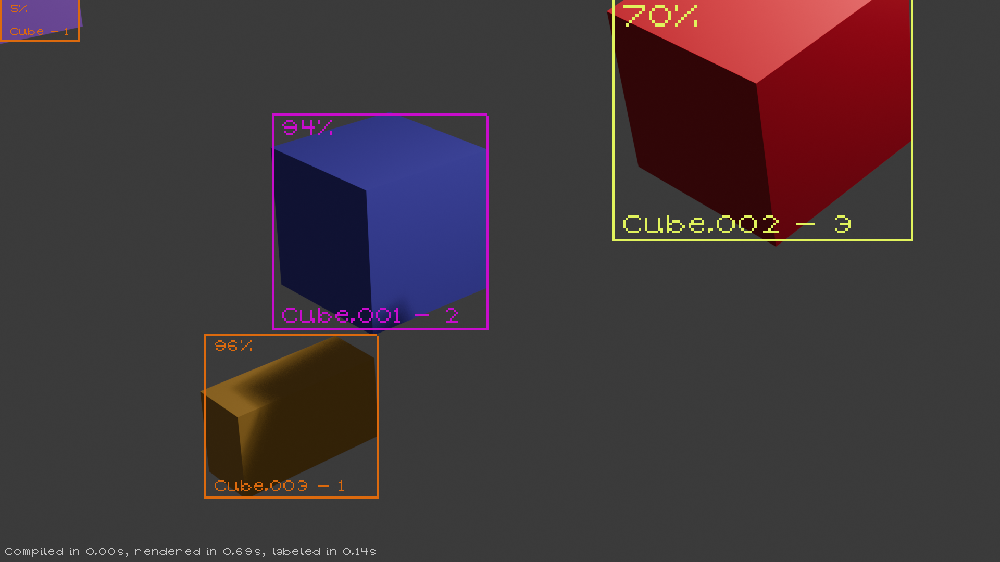

# Synthetic Renders generator for Blender
A Blender extension for generating synthetic datasets through procedural randomization and batch rendering. This addon enables users to create diverse image datasets with controlled variations in object placement, material properties, lighting conditions, and scene parameters.

## Overview

The Generator provides a node-based system for defining randomization pipelines within Blender. Users can specify how objects, materials, and lighting conditions should vary across multiple renders, then automatically output images with corresponding metadata suitable for computer vision training datasets.

## Features


- **Distribution-Based Randomization**: Define probability distributions for scene parameters using a visual node editor
- **Pipeline Configuration**: Build randomization pipelines by connecting operations for object transforms, material properties, and lighting
- **Batch Rendering**: Automatically render multiple images with varied scene parameters
- **JSON Configuration**: Load and save pipeline configurations as JSON for version control and reproducibility
- **Multi-Parameter Support**:
  - Object position, rotation, and scale
  - Material textures and properties (roughness, metallic, etc.)
  - Visibility and occlusion constraints
  - Lighting intensity, temperature, and color
  - Camera parameters and positioning
  - Ground plane and boundary constraints
- **Export Integration**: Export rendered datasets in formats compatible with computer vision frameworks (YOLO, etc.)

- **Live Preview**: Allows the user to generate previews of the output of the blender directly inside Blender, including boundary boxes, labels and visibility statistics

## System Requirements

- **Blender**: 4.5.0 or later
- **Python**: 3.10+ (included with Blender)
- **OS**: Windows, macOS, or Linux

## Installation

1. Download the /ext/ extension archive and compress it as a `.zip` archive. 
2. In Blender, navigate to **Edit → Preferences → Add-ons**
3. Click **Install...** and select the downloaded `.zip` file
4. Enable the addon by checking the box next to "Random Dataset Generator"

The addon will appear in the 3D Viewport sidebar under the **Randomizer** panel.

## Quick Start

### 1. Create a Distribution

A distribution defines how a parameter varies across renders. Access the Distribution Editor through the Randomizer panel to create distributions for your parameters.
```
Distribution Editor → Add Nodes → Configure Parameters
```

### 2. Build a Pipeline

Connect operations in the pipeline editor to specify which objects and properties should be randomized.
```
Pipeline Tab → Add Operation → Configure Operation → Connect to Distribution
```

### 3. Configure Parameters

Specify which objects, materials, and properties are affected by each operation. Each operation can target:
- Specific objects or material slots
- Defined lighting rigs
- Camera positions
- Constraint parameters

### 4. Generate Dataset

Once the pipeline is configured, render the dataset:
```
Generate Tab → Set output directory → Set frame count → Render
```

Outputs are saved as:
- Rendered images (PNG/EXR format)
- Metadata JSON files (one per frame)
- Configuration snapshot and logs (for reproducibility)

## Architecture

The extension is organized into logical modules:
```
ext/
├── distribution/      # Distribution node system and evaluation
├── pipeline/          # Pipeline data structures and operations
├── operators/         # Blender operators (UI interactions)
├── ui/                # User interface panels and viewers
├── core/              # Core rendering and generation logic
├── utils/             # Logging and utility functions
└── constants.py       # Configuration constants
```

## Key Concepts

### Distributions
Distributions define probability functions for randomization:
- **Constant**: Fixed values
- **Continuous** (Normal, Uniform): Sampled probability distributions
- **Discrete**: Selection from predefined values
- **Selector**: Random choice among inputs, allowing for complex definitions of multimodal distributions

### Pipeline Operations
Operations apply randomization to scene elements:
- **Transform**: Position, rotation, scale
- **Material**: Texture and property randomization
- **Lighting**: Light intensity, color, temperature
- **Camera**: Position and orientation
- **Constraints**: Overlap, occlusion, distance rules

### Configurations
Pipelines can be saved and loaded as JSON, enabling:
- Version control of experiment configurations
- Reproducible dataset generation
- Easy parameter tuning and iteration

## Usage Patterns

### Basic Workflow
1. Set up a Blender scene with objects, materials, and lighting
2. Create distributions for parameters you want to vary
3. Build a pipeline connecting those distributions to scene elements
4. Configure constraints and output settings
5. Render the dataset

### Advanced Workflows
- **Multi-Stage Randomization**: Chain multiple operations to create complex variations
- **Constrained Randomization**: Use overlap, occlusion, and distance constraints to ensure valid configurations
- **Conditional Variations**: Use selector nodes to choose between different randomization strategies
- **Parameter Sweeps**: Create multiple pipeline variants to explore design space

## JSON Configuration Format

Pipelines are stored as JSON for reproducibility:
```json
{
  "version": "1.0.0",
  "operations": [
    {
      "type": "Position",
      "target_objects": ["Cube"],
      "distribution": "position_distribution",
      "enabled": true
    }
  ],
  "distributions": [
    {
      "name": "position_distribution",
      "type": "continuous",
      "parameters": {"mean": 0.0, "sigma": 1.0}
    }
  ],
  "output": {
    "format": "PNG",
    "directory": "/path/to/output"
  }
}
```

## Limitations

- Complex shader networks may not be fully randomized through the UI; direct material node editing may be necessary for advanced cases
- Very large pipelines with many operations may impact interactive performance

## Contributing

This is a user-focused addon. Bug reports and feature requests can be submitted through the project repository.

## Documentation

Full documentation and tutorials are available at:
https://github.com/lorenzozanizz/synth-blender-dataset/wiki

## Support

For issues, questions, or feature requests, please visit the GitHub repository or consult the documentation wiki.

---

**Version**: 1.0.0  
**Last Updated**: 2026  
**Target Blender Version**: 4.5+
