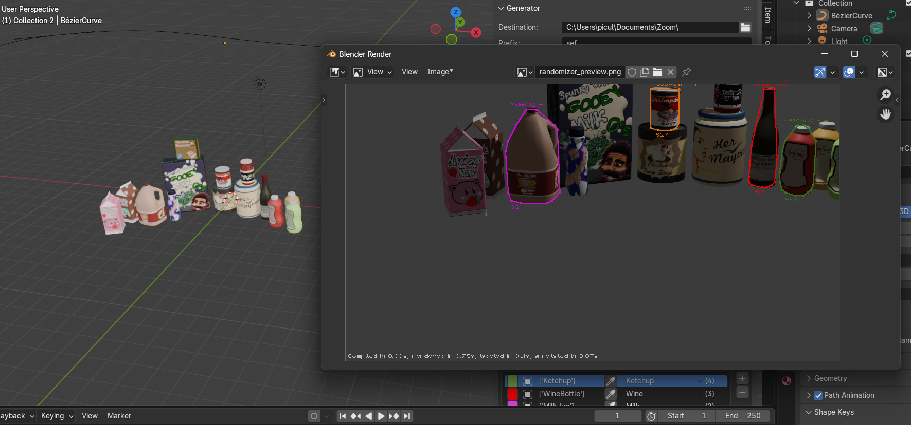

# Gensynth

A Blender extension for generating synthetic datasets through procedural randomization and batch rendering. This addon enables users to create diverse image datasets with controlled variations in object placement, material properties, lighting conditions, and scene parameters.
Additionally, the extensions supports a preview functionality which allows to inspect the output of the pipeline and the computed labels directly inside Blender.

The extensions is intended for low to medium sized computer vision products, wihch benefit more from ease of generation rather than the efficiency and generality of tools like Blenderproc. 

## Overview
  

The Generator provides a building-block system for defining randomization pipelines within Blender. Users can specify how objects, materials, and lighting conditions should vary across multiple renders, then automatically output images with corresponding metadata suitable for computer vision training datasets.
User can also specify named classes and assign classes to blender objects. Multiple objects can be grouped together to form multi-object entities which the extension will classify as a single object. 

## Features

- **Distribution-Based Randomization**: Define probability distributions for scene parameters using preset distributions and (work in progress) a visual node editor
- **Pipeline Configuration**: Build randomization pipelines by concatenating operations for object transforms, material properties, and lighting
- **Batch Rendering**: Automatically render multiple images with varied scene parameters, setting an initial seed of reproducibility
- **JSON Configuration**: Load and save pipeline configurations as JSON for version control and reproducibility
- **Multi-Parameter Support**:
  - Object position, rotation, and scale
  - Material textures and properties (roughness, metallic, etc.)
  - Visibility and occlusion constraints
  - Lighting intensity, temperature, and color
  - Camera parameters and positioning, locking of camera around a central point0
  - Ground plane and boundary constraints (work in progress)
- **Export Integration**: Export rendered datasets in formats compatible with computer vision frameworks (YOLO, COCO, etc.)

- **Live Preview**: Allows the user to generate previews of the output of the blender directly inside Blender, including boundary boxes, labels and visibility statistics

- **Logging system** (work in progress) Allows to analyze the results of single stochastic processes to inspect the generation and the outut of constraints solvers (work in progress)

## System Requirements

- **Blender**: 4.5.0 or later
- **OS**: Windows, macOS, or Linux

## Installation

1. Download the repository and select the /ext/ extension archive and compress it as a `.zip` archive. 
2. In Blender, navigate to **Edit → Preferences → Add-ons**
3. Click **Install...** and select the downloaded `.zip` file
4. Enable the addon by checking the box next to "Random Dataset Generator"

The addon will appear in the 3D Viewport sidebar under the **Synthetic** panel.

## Quick Start

### 1. Create classes and entities

A distribution defines how a parameter varies across renders. Access the Distribution Editor through the Randomizer panel to create distributions for your parameters.
```
Distribution Editor → Add Nodes → Configure Parameters
```

### 2. Build a Pipeline

Connect operations in the pipeline editor to specify which objects and properties should be randomized.
```
Pipeline Tab → Add Operation → Configure Operation → Connect to Distribution
```

### 3. Configure Parameters

Specify which objects, materials, and properties are affected by each operation. Each operation can target:
- Specific objects or material slots
- Defined lighting rigs
- Camera positions
- Constraint parameters

### 4. Generate Dataset

Once the pipeline is configured, render the dataset specifying the amount of samples extracted from the distribution and the labeling format:
```
Generate Tab → Set output directory → Set frame count → Render
```

Outputs are saved as:
- Rendered images (PNG/EXR format)
- Metadata txt/Json files (one per frame) depending on the labeling format
- Configuration snapshot and logs (for reproducibility)
Render settings are extracted from the current Blender settings at the time of generation.

## Architecture

The extension is organized into logical modules:
```
ext/
├── distribution/      # Distribution node system and evaluation
├── pipeline/          # Pipeline data structures and operations
├── operators/         # Blender operators (UI interactions)
├── ui/                # User interface panels and viewers
├── core/              # Core rendering and generation logic
├── utils/             # Logging and utility functions
└── constants.py       # Configuration constants
```
A more thorough description is detailed inside /docs/Architecture Overview.md

## Key Concepts

### Distributions
Distributions define probability functions for randomization. Two modes are provided to randomize most operations: using a preset distribution (normal, exponential, etc...) or generating a custom distribution through a node based editor (still incomplete). The editor allows the interconnection of nodes: 
- **Constant**: Fixed values
- **Continuous** (Normal, Uniform, ...): Sampled probability distributions
- **Discrete**: Selection from predefined values
- **Selector**: Random choice among inputs, allowing for complex definitions of multimodal distributions

### Pipeline Operations
Operations apply randomization to scene elements:
- **Transform**: Position, rotation, scale
- **Material**: Texture and property randomization
- **Lighting**: Light intensity, color, temperature
- **Camera**: Position and orientation
- **Constraints**: Overlap, occlusion, distance rules (work in progress) 

### Configurations
Pipelines can be saved and loaded as JSON, enabling:
- Version control of experiment configurations
- Reproducible dataset generation
- Easy parameter tuning and iteration

## Usage Patterns

### Basic Workflow
1. Set up a Blender scene with objects, materials, and lighting
2. Create a set of classes and entities
4. Build a pipeline concatenating stochastic variations to the scene
5. Configure constraints and render settings in Blender, labeling settings in the extension
6. Render the dataset and obtain text labels

### Advanced Workflows
- **Multi-Stage Randomization**: Chain multiple operations to create complex variations
- **Constrained Randomization**: Use overlap, occlusion, and distance constraints to ensure valid configurations (work in progress)
- **Conditional Variations**: Use selector operations and folders to choose between different randomization strategies
- **Parameter Sweeps**: Create multiple pipeline variants to explore design space

## JSON Configuration Format

Pipelines are stored as JSON for reproducibility and sharing across .blend files:

## Limitations

- Complex shader networks may not be fully randomized through the UI; direct material node editing may be necessary for advanced cases
  (the idea is to randomize certain nodes in the shader which impact the appearence of the full Cycles material)
- Very large pipelines with many operations may impact interactive performance, EEVEE is reccomended for preview. 

## Contributing

This is a user-focused addon. Bug reports and feature requests can be submitted through the project repository.

## Documentation

Some documentation and tutorials are (will be) available at:
[https://github.com/lorenzozanizz/synth-blender-dataset/docs
](https://github.com/lorenzozanizz/synth-blender-dataset/tree/main/docs)

[https://github.com/lorenzozanizz/synth-blender-dataset/examples
](https://github.com/lorenzozanizz/synth-blender-dataset/tree/main/examples)

## Support

For issues, questions, or feature requests, please visit the GitHub repository or consult the documentation wiki.

---

**Version**: 1.0.0  
**Target Blender Version**: 4.5+

# Acknowledgements and attributions
Models from [Sketchfab](https://sketchfab.com/3d-models/samw-packaged-super-store-products-eb61f24679654b0886bb97556193f771) used on some examples. Sometimes the code was readapted from online snippets, the github repository is always cited in the code documentation when this is the case. 
