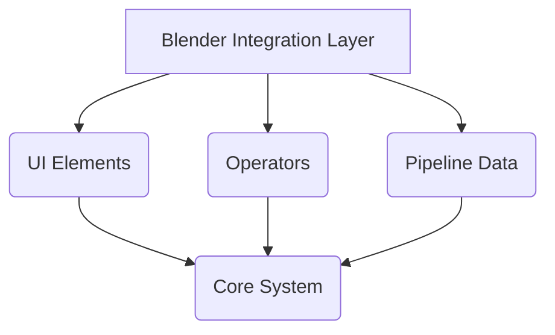

# Architecture Documentation

## Overview

This document describes the technical architecture of the Blender Random Dataset Generator extension. The extension enables procedural variation of 3D scenes through a pipeline-based operation system, supporting object transformations, material modifications, and batch rendering.

The codebase is organized into seven primary subsystems: core, pipeline, distribution, operators, UI, utilities, and entry points.

---

## System Architecture

### High-Level Structure

The architecture follows the usual blender extension architecture in which the code is structured around the Blender API
with Operators and handlers. 


---

## Module Breakdown

### 1. Entry Point: `__init__.py`

**Key Responsibilities**:
- Import all subsystem classes
- Define `bl_info` (addon metadata)
- Aggregate and register all Blender classes
- Aggregate and attach scene properties from all modules
- Register node categories
- Register/unregister event handlers

**Dependencies**: All subsystems

---

### 2. Constants: `constants.py`

**Purpose**: Centralized configuration and enumerations.

**Contents**:
- **Naming conventions**: Panel name prefixes to avoid conflicts with other scene variables
- **Pipe Keys** Each type of pipe in the pipeline is assigned a string type which is used as key in different  registries around the code. 
 This happens inside **Enum - PipeNames**:

---

### 3. Pipeline System: `ext/pipeline/`

The pipeline system manages operation definitions, storage, and registry patterns.
Each pipe operation is registered with its name taken from the constants.py module. 

```python
class OperationRegistry:
    _operations = {}
    
    @classmethod
    def register(cls, op_type: str):
        """Decorator to register an operation class"""
        def decorator(drawer_cls):
            cls._operations[op_type] = drawer_cls
            return drawer_cls
        return decorator
    
    @classmethod
    def get(cls, operation_type: str) -> PipelineOperation:
        """Get operation instance by type name"""
        if operation_type not in cls._operations:
            raise ValueError(f"Unknown operation type: {operation_type}")
        return cls._operations[operation_type]()
    
    @classmethod
    def get_all_types(cls) -> list:
        """Get all registered operation type names"""
        return list(cls._operations.keys())
```
Operations register themselves using the `@OperationRegistry.register()` decorator at import time.

#### 3.2 Operations: `operations.py`

**Purpose**: Define executable operation classes. These are different from the blender Operators, which are associated with the blender GUI interface.  
These operators change the scene objects when randomizing at each step. 

**Base Class**:
```python
class PipelineOperation(ABC):
    """Base class for all pipeline operations."""
    
    operation_type: str  # Must be set by subclasses
    
    @abstractmethod
    def from_config(self) -> dict:
        """Load configuration from stored data"""
        pass
    
    @abstractmethod
    def execute(self, scene, objects):
        """Execute this operation on scene/objects"""
        pass
```

#### 3.3 Data Storage: `data.py`

**Purpose**: Define Blender PropertyGroup storage structures.

**PropertyGroup Hierarchy**:
```python
class PipelineOperation(PropertyGroup):
    """Single operation in the pipeline"""
    operation_type: StringProperty(name='Type', default='randomize_pose')
    enabled: BoolProperty(name='Enabled', default=True)
    name: StringProperty(name='Name', default="Unnamed")
    config: StringProperty(name='Config', default='{}')  # JSON string

class PipelineData(PropertyGroup):
    """Container for all operations"""
    operations: CollectionProperty(type=PipelineOperation)
    active_operation_index: IntProperty(default=0)
```

**Storage Pattern**: Operations are stored as a Blender collection. Each operation contains:
- Type identifier (references PipeNames enum)
- Enabled/disabled flag
- Display name
- Configuration JSON string

**Attachment**: `pipeline_data` is attached to `bpy.types.Scene` at addon registration.

**Access in Code**:
```python
scene = bpy.context.scene
pipeline = scene.pipeline_data
for operation in pipeline.operations:
    op_type = operation.operation_type
    config = json.loads(operation.config)
```

---

### 4. Distribution System: `ext/distribution/`

The distribution system manages probability distributions via a custom node editor whenever the user needs a multimodal / customized 
distribution to randomize a certain property.

#### 4.1 Node Tree: `nodes.py`

**Purpose**: Define custom node types for building distribution graphs.

**Node Classes**:

| Node Type | Purpose                                    | Properties |
|-----------|--------------------------------------------|-----------|
| `DistributionRootNode` | Entry point for distribution graph         | Input socket |
| `DistributionConstantNode` | Fixed value                                | `value: float` |
| `DistributionContinuousNode` | Preset continuous distribution             | `dist_type`, `mean`, `sigma` |
| `DistributionDiscreteNode` | Discrete values from set or discrete range | `values: string` (comma-separated) |
| `DistributionSelectorNode` | Fan-in combiner (selects one input)        | Configurable input count |

**Architecture**: 
- Nodes are visually composable in Blender's node editor
- Sockets define data flow 
- Depending on the value being randomized, a distribution is required to have a certain dimensionality. Preset distributions encode this directly, while a custom distribution needs to handle vectorial distributions explicitly. 

NOTE: Custom polling methods ensure nodes only appear in Distribution editor

#### 4.4 Helper Modules

- **`color.py`**: Color distribution utilities (when implemented)
- **`nodes.py`**: Node class definitions (detailed above)

---

### 5. Operators System: `ext/operators/`

Operators implement Blender's action system. They respond to UI interactions and execute modifications.

#### 5.1 Operator Registry: `names.py`

**Purpose**: Centralize operator identifiers to safely reference them and dynamically register them. Whenever a UI elements wishes 
to import an operator, the label is extracted from the Labels enum so there cannot be any "wrong name" dangling references and changing an 
operator label is centralized. 

```python
class Labels(Enum):
    ADD_PIPE = "randomizer.add_pipe"
    REMOVE_PIPE = "randomizer.remove_pipe"
    EDIT_PIPE = "randomizer.edit_pipe"
    SAVE_PIPE = "randomizer.save_pipe"
    # ... 20+ operators
```

#### 5.2 Pipeline Operators: `pipeline_ops.py`

**Core Operators**:

| Operator | Class | Purpose |
|----------|-------|---------|
| `randomizer.add_pipe` | `PipeAddOperator` | Add new operation to pipeline |
| `randomizer.remove_pipe` | `PipeRemoveOperator` | Remove selected operation |
| `randomizer.edit_pipe` | `EditPipeOperator` | Switch to edit view, load config |
| `randomizer.save_pipe` | `SavePipeOperator` | Save edited config back to operation |

**Object Capture Operators**:
- `CaptureObjectsOperator`: Capture selected objects for targeting
- `CaptureTextureOperator`: Capture selected texture node
- `CaptureObjectPositionOperator`: Capture object world position
- `CaptureDistributionValueNode`: Capture Value node from material
- `CaptureAndModifyNodeProperties`: Debug operator for node introspection

#### 5.3 Graphical Operators: `graphical_ops.py`

**UI Control Operators**:
- `OpenDistributionOperator`: Open custom distribution editor
- `PipeUpOperator`, `PipeDownOperator`: Reorder operations
- `ChangePipelineViewerTabOperator`: Switch UI tabs (View/Edit)
- `AddFolderOperator`: Create folder structures in pipeline

#### 5.4 I/O Operators: `io_ops.py`

**File I/O Operators**:
- `SavePipelineAsOperator`: Export pipeline to JSON file
- `LoadPipelineOperator`: Import pipeline from JSON file
- `ApplyLogPathOperator`: Set logging directory
- `OpenLogsOperator`: Open log files in system viewer

#### 5.5 Distribution Operators: `distribution_ops.py`

**Distribution Management**:
- `AddDistributionOperator`: Create new distribution graph
- `RemoveDistributionOperator`: Delete distribution graph
- `AddImagePathOperator`: Add texture to pool
- `RemoveImagePathOperator`: Remove texture from pool

---

### 6. UI System: `ext/ui/`

The UI layer renders panels, lists, and editors in Blender's interface.

#### 6.1 Main Panels: `panels.py`

**Panel Hierarchy**:

| Panel | Class | Purpose                                   | Order |
|-------|-------|-------------------------------------------|-------|
| Generator | `RandomizerPanel` | Main controls (destination, amount, seed) | 0 |
| Pipeline Editor | `RegistrationPanel` | Pipeline operations list and editor       | 1 |
| Settings | `SettingsPanel` | Logging and preferences          | 2 |
| Info | `InfoPanel` | Version info and documentation links      | 3 |

#### 6.2 Pipeline Editor: `pipeline_list_viewer.py`

The pipeline editor is the panel which allows the user to visualize the current pipeline and edit individual pipes. This panel has two visualization 
modes: 
- In the list ('ops') mode, all operations are listed and the user can change their relative order in the pipeline
- In the configuration ('config') mode a single operaation is selected to be edited. This gives the user a set of tools to select objects in the scene and customize a randomization distribution. 

**Operation Menus**: Hierarchical add menus to add different kinds of pipes.
   - `AddObjectCategoryPipeMenu`: Position, Rotation, Scale, Visibility, Move
   - `AddMaterialCategoryPipeMenu`: Material, Texture, Metallic, Roughness, etc.
   - `AddLightingCategoryPipeMenu`: Temperature, Power, Color
   - `AddConstraintCategoryPipeMenu`: Overlap, Occlusion, Distance
   - `AddCameraCategoryPipeMenu`: (placeholder)
   - `AddExperimentalCategoryPipeMenu`: (placeholder)

**View Modes**:

**List View** (active == 'ops'):
```
[Header: "Pipeline length: 3 operations"]
[+/- buttons]
[UIList showing all operations with indices]
[Load/Save pipeline buttons]
```

**Edit View** (active == 'config'):
```
[Header: "Editing: Randomize Pose"]
[Editor widgets for operation config]
[Save button]
```

#### 6.3 Operation Editor: `pipe_editor.py`

**OperationDrawerRegistry**: Parallel registry to `OperationRegistry` but for UI.

Each drawer can use a set of "UI widgets" contained in `ui/widgets.py`. They are a set of re-usable sections for example to select a distribution or an object in the scene. 

```python
class OperationDrawerRegistry:
    _drawers = {}
    
    @classmethod
    def register(cls, op_type: str):
        def decorator(drawer_cls):
            cls._drawers[op_type] = drawer_cls
            return drawer_cls
        return decorator
    
    @classmethod
    def get(cls, op_type: str):
        return cls._drawers.get(op_type)
```

**Base Class**:
```python
class PipeDrawer(ABC):
    operation_type: str
    
    @staticmethod
    def draw_editor(layout, context) -> None:
        """Draw this operation's editor UI"""
        pass
```

**Example Implementation**:
```python
class ScalarPropertyDrawer(PipeDrawer):
    @staticmethod
    def draw_editor(layout, context) -> None:
        ObjectTargeter.draw(layout, context)        # Select target object
        layout.separator()
        AxisTarget.draw(layout, context)            # Select axis (X/Y/Z)
        layout.separator()
        NodeDistributionSelector.draw(layout, context, dim=1)  # Choose distribution
```

#### 6.4 Editor Widgets: `pipe_edit_widgets.py`

**Purpose**: Reusable UI widget components for operation editing.

**Widget Classes** (drawable components):
- `ObjectTargeter`: Select which objects to modify
- `AxisTarget`: Choose X/Y/Z axis
- `ImageTextureTargeter`: Select texture node
- `PathListSelector`: Choose from texture pool
- `PositionListSelector`: Choose from position pool
- `MaterialSelector`: Choose from material pool
- `NodeDistributionSelector`: Assign distribution node
- `SimplifiedDistributionSelector`: Simple distribution choice
- `ValueTargeter`: Target a Value node
- `PropertyTargeter`: Target arbitrary node property

**Pattern**: Each widget has a static `draw()` method:
```python
class ObjectTargeter:
    @staticmethod
    def draw(layout, context):
        scene = context.scene
        box = layout.box()
        box.label(text="Target Object", icon='CUBE')
        box.prop(scene, "targeted_object_display", text="")
        box.operator(Labels.CAPTURE_OBJECTS.value, text="Capture Selection")
```

#### 6.5 Config Schema: `pipe_schema.py`

**Purpose**: Define configuration serialization/deserialization for operations.

**Registry**:
```python
class PipeSchemaRegistry:
    _pipes_schema = {}
    
    @classmethod
    def register(cls, op_type: str):
        def decorator(drawer_cls):
            cls._pipes_schema[op_type] = drawer_cls
            return drawer_cls
        return decorator
    
    @classmethod
    def get(cls, operation_type: str) -> 'PipeSchema':
        if operation_type not in cls._pipes_schema:
            return None
        return cls._pipes_schema[operation_type]()
```

**Base Class**:
```python
class PipeSchema(ABC):
    @staticmethod
    @abstractmethod
    def extract_config_from_ui(context, operation) -> dict:
        """Read UI values and return config dict"""
        pass
    
    @staticmethod
    @abstractmethod
    def apply_config_to_ui(context, operation, config) -> None:
        """Load config dict into UI"""
        pass
```
As for drawing in UI, pipe schemas can use a set of serialization functions offered by the widgets to access the data of their properties in a 
centralized manner.

#### 6.6 Properties: `properties.py`

**Purpose**: Define scene properties for UI inputs.

**Property Categories**:
- Object/position targeting properties
- Distribution selection properties
- Material/texture pool properties
- Logging and file path properties
- Operation-specific configuration properties

**Example**:
```python
ext_ui_properties = {
    "randomizer_destination_path": StringProperty(
        name="Destination",
        description="Where to save rendered images",
        subtype='DIR_PATH'
    ),
    "randomizer_amount": IntProperty(
        name="Amount",
        default=10,
        min=1
    ),
    "randomizer_seed": IntProperty(
        name="Seed",
        default=0
    ),
    # ... 30+ properties
}
```

#### 6.7 Event Handlers: `handlers.py`

**Purpose**: Respond to scene changes asynchronously.

**Registered Handler**:
```python
def sync_distribution_handler(scene):
    """Synchronizes scene.available_distributions with actual bpy.data.node_groups."""
    
    actual_trees = [
        tree for tree in bpy.data.node_groups
        if tree.bl_idname == "DistributionNodeTree"
    ]
    
    # Remove stale entries
    # Add new entries
    # Update pointers
```

**Registration**:
```python
def register_handlers():
    bpy.app.handlers.depsgraph_update_post.append(sync_distribution_handler)

def unregister_handlers():
    if sync_distribution_handler in bpy.app.handlers.depsgraph_update_post:
        bpy.app.handlers.depsgraph_update_post.remove(sync_distribution_handler)
```

**Trigger**: Runs after each scene dependency graph update (object changes, property edits).

---

### 7. Core System: `ext/core/`

Execution and utility functions.

#### 7.1 Generation: `generation.py`

**Purpose**: Placeholder for core dataset generation logic.

#### 7.2 Labeling: `labeling.py`

**Purpose**: Placeholder for annotation generation (if implemented).

#### 7.3 Names: `names.py`

**Purpose**: Operator label enumerations.

```python
class CoreLabels(Enum):
    GENERATE = "randomizer.generate"
    # ... core operator names
```

---

### 8. Utilities: `ext/utils/`

#### 8.1 Logger: `logger.py`

**Purpose**: Centralized logging for debugging and user feedback. This allows the user to access for each generated frame the extracted values from
 the random distributions and the choices, as well as contraints satisfactions. 

---

## Data Flow Diagram

### Adding an Operation

```
User clicks "Add" button in UI
        |
MenuOperator draws popup menu
        |
User selects operation type (e.g., "Scale")
        |
PipeAddOperator.execute() called with op_name="Scale"
        |
Creates new PipelineOperation in CollectionProperty
        |
Sets operation_type, enabled, config
        |
Stored automatically in bpy.types.Scene.pipeline_data.operations
```

### Editing an Operation

```
User clicks "Edit" button in UIList
        |
EditPipeOperator sets active_operation_index
        |
RegistrationPanel detects tab change to 'config'
        |
draw_edit_view() looks up OperationDrawerRegistry
        |
Gets PipeDrawer subclass for operation_type
        |
Calls PipeDrawer.draw_editor(layout, context)
        |
Widgets render UI (ObjectTargeter, AxisTarget, etc.)
        |
User modifies values (scene properties bound to UI)
        |
User clicks "Save"
        |
SavePipeOperator.execute()
        |
Looks up PipeSchemaRegistry by operation_type
        |
Calls extract_config_from_ui() to gather values
        |
Serializes config to JSON string
        |
Stores in operation.config
        |
Config persists with .blend file (PropertyGroup)
```

### Distribution Graph Evaluation

```
User creates nodes in DistributionNodeTree editor
        |
Nodes linked with DistributionSocket connections
        |
Operation editor shows NodeDistributionSelector widget
        |
User selects distribution node from dropdown
        |
Reference stored in operation config
        |
At render time, distribution is evaluated via computation.py
        |
Values sampled and applied to operation targets
```

---

## Registry Patterns

### Pattern 1: OperationRegistry (Execution)

**Location**: `ext/pipeline/registry.py`

**Purpose**: Map operation type strings to executable classes.

**Usage**:
```python
@OperationRegistry.register(PipeNames.SCALE.value)
class RandomizeScaleOperation(PipelineOperation):
    def execute(self, scene, objects):
        pass

# Lookup
op_instance = OperationRegistry.get('Scale')
```

### Pattern 2: OperationDrawerRegistry (UI)

**Location**: `ext/ui/pipe_editor.py`

**Purpose**: Map operation type strings to UI drawer classes.

**Usage**:
```python
@OperationDrawerRegistry.register(PipeNames.SCALE.value)
class RandomizeScaleOperation(ScalarPropertyDrawer):
    @staticmethod
    def draw_editor(layout, context):
        pass

# Lookup
drawer = OperationDrawerRegistry.get('Scale')
drawer.draw_editor(layout, context)
```

### Pattern 3: PipeSchemaRegistry (Config Serialization)

**Location**: `ext/ui/pipe_schema.py`

**Purpose**: Map operation type strings to config serialization classes.

**Usage**:
```python
@PipeSchemaRegistry.register(PipeNames.SCALE.value)
class ScaleSchema(PipeSchema):
    @staticmethod
    def extract_config_from_ui(context, operation):
        return { ... }

# Lookup
schema = PipeSchemaRegistry.get('Scale')
config = schema.extract_config_from_ui(context, operation)
```

---

## Design Patterns

### 1. Decorator-Based Registry

Three independent registries use decorators for self-registering classes:
- Operation execution (`OperationRegistry`)
- Operation UI drawing (`OperationDrawerRegistry`)
- Operation config serialization (`PipeSchemaRegistry`)

**Benefit**: Adding a new operation type requires only defining classes with decorators; registration is automatic.

### 2. PropertyGroup Storage

Blender's PropertyGroup system persists data automatically with .blend files.

```python
scene.pipeline_data.operations  # CollectionProperty
|
[PipelineOperation]  # Each has: type, name, enabled, config
```

**Benefit**: No manual file I/O needed for persistence.

### 3. Factory-Like Pattern

Registries act as factories, creating instances on demand:
```python
OperationRegistry.get(type_string)  # Returns instance
OperationDrawerRegistry.get(type_string)  # Returns instance
```

### 4. Separation of Concerns

- **Execution** (`operations.py`): What the operation does
- **UI** (`pipe_editor.py`): How to configure it
- **Serialization** (`pipe_schema.py`): How to save/load it

Each can evolve independently.

---

## Extension Points

### Adding a New Operation Type

1. **Define operation class** in `ext/pipeline/operations.py`:
   ```python
   @OperationRegistry.register(PipeNames.MY_OP.value)
   class MyOperation(PipelineOperation):
       def execute(self, scene, objects):
           # Implementation
           pass
   ```

2. **Define UI drawer** in `ext/ui/pipe_editor.py`:
   ```python
   @OperationDrawerRegistry.register(PipeNames.MY_OP.value)
   class MyOperationDrawer(PipeDrawer):
       @staticmethod
       def draw_editor(layout, context):
           # UI implementation
           pass
   ```

3. **Define config schema** in `ext/ui/pipe_schema.py`:
   ```python
   @PipeSchemaRegistry.register(PipeNames.MY_OP.value)
   class MyOperationSchema(PipeSchema):
       @staticmethod
       def extract_config_from_ui(context, operation):
           # Gather UI values
           pass
       
       @staticmethod
       def apply_config_to_ui(context, operation, config):
           # Load config into UI
           pass
   ```

4. **Add enum value** to `constants.py`:
   ```python
   class PipeNames(Enum):
       MY_OP = "My Operation"
   ```

5. **Add to menu** in `ext/ui/pipeline_list_viewer.py`:
   ```python
   layout.operator(Labels.ADD_PIPE.value, text="My Operation",
                   icon=my_icon).op_name = PipeNames.MY_OP.value
   ```

---

## Blender Integration Points

### Panels (UI Layout)
- `RandomizerPanel`: Main generation controls
- `RegistrationPanel`: Pipeline editor
- `SettingsPanel`: Logging settings
- `InfoPanel`: Version info

### PropertyGroups (Data)
- `PipelineData`: Root data container
- `PipelineOperation`: Individual operation

### Operators (Actions)
- 25+ operator classes responding to UI interactions

### Node Trees (Custom Editor)
- `DistributionNodeTree`: Distribution graph editor
- 5 custom node types

### Event Handlers
- `sync_distribution_handler`: Keeps distribution list in sync

### Scene Properties
- 30+ properties attached to `bpy.types.Scene` at registration

---

## Folder Structure Summary

```
ext/
├── __init__.py                    # Entry point, registration
├── constants.py                   # Enums, configuration
├── core/                          # Execution logic
│   ├── __init__.py
│   ├── generation.py              # Dataset generation
│   ├── labeling.py                # Annotation logic
│   └── names.py                   # Operator labels
├── pipeline/                      # Operation system
│   ├── __init__.py
│   ├── data.py                    # PropertyGroup definitions
│   ├── operations.py              # Operation implementations
│   └── registry.py                # Operation registry
├── distribution/                  # Distribution graph system
│   ├── __init__.py                # Node categories
│   ├── color.py                   # Color distributions
│   ├── computation.py             # Distribution evaluation
│   └── nodes.py                   # Node definitions
├── operators/                     # Blender operators
│   ├── __init__.py                # Operator aggregation
│   ├── names.py                   # Operator identifiers
│   ├── pipeline_ops.py            # Pipeline manipulation
│   ├── graphical_ops.py           # UI control
│   ├── io_ops.py                  # File I/O
│   └── distribution_ops.py        # Distribution management
├── ui/                            # User interface
│   ├── __init__.py                # UI class aggregation, handlers
│   ├── panels.py                  # Main panels
│   ├── pipeline_list_viewer.py    # Operation list and menus
│   ├── pipe_editor.py             # Drawer registry and drawers
│   ├── pipe_edit_widgets.py       # Reusable UI widgets
│   ├── pipe_schema.py             # Config serialization
│   ├── properties.py              # Scene property definitions
│   └── handlers.py                # Event handlers
└── utils/                         # Utilities
    └── logger.py                  # Logging system
```

---

## Implementation Status

| Component | Status | Notes |
|-----------|--------|-------|
| Data storage | ✓ Complete | PropertyGroup-based, persists with .blend |
| Registries | ✓ Complete | Three independent registries (exec, UI, schema) |
| UI panels | ✓ Complete | All main panels implemented |
| Operation list | ✓ Complete | UIList with full editor |
| Distribution editor | ✓ Complete | Custom node tree with 5 node types |
| Operators | ✓ Complete | 25+ operators for UI interactions |
| Operation execution | ⚠ Stubs | Abstract classes defined, execute() not implemented |
| Config extraction | ⚠ Partial | Schema registry defined, implementations incomplete |
| Dataset generation | ⚠ Placeholder | `core/generation.py` needs implementation |

---

## Key Design Decisions

1. **Three Parallel Registries**: Decouples execution, UI, and serialization concerns.
2. **PropertyGroup Storage**: Automatic persistence with .blend files, no manual I/O.
3. **JSON Config Strings**: Simple serialization, human-readable, version-compatible.
4. **Custom Node Editor**: Distributoins modeled as visual graphs, not tables.
5. **Widget Components**: Reusable UI blocks (ObjectTargeter, etc.) reduce duplication.
6. **Decorator Registration**: Automatic discovery of new operations at import time.