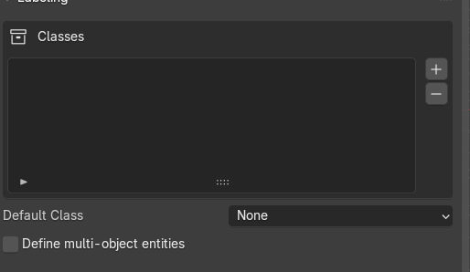
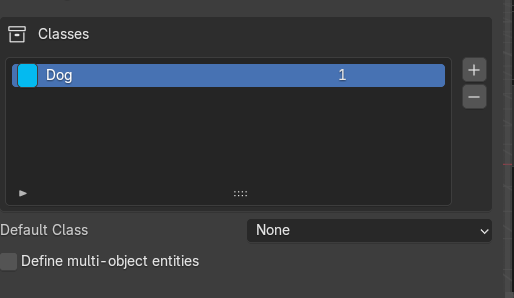
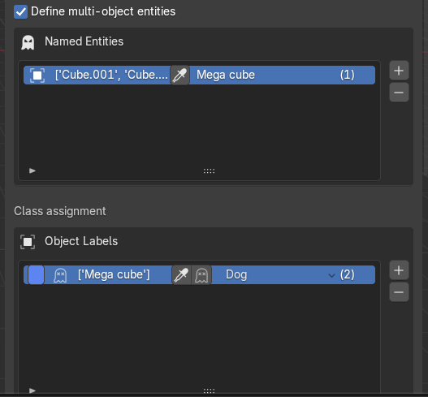
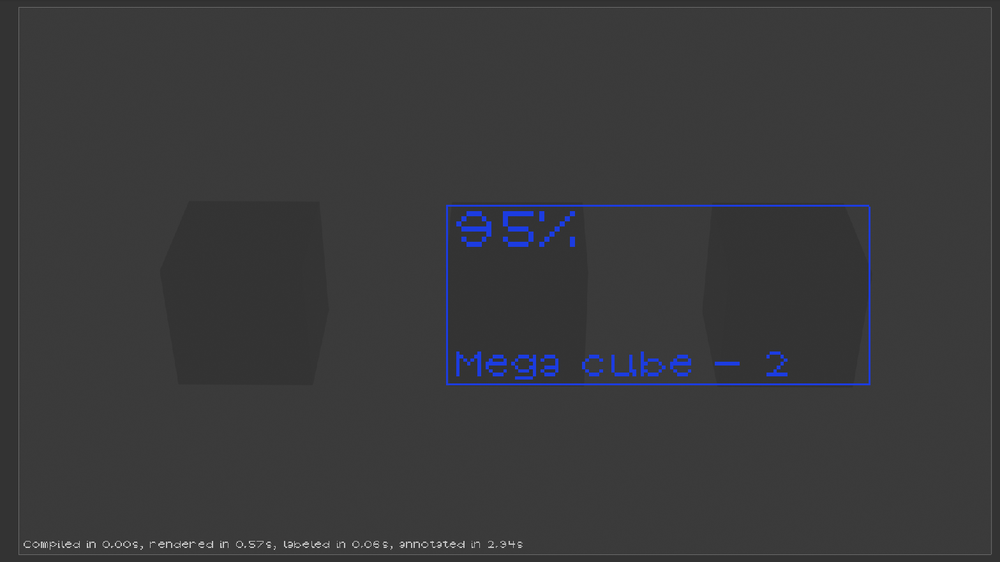
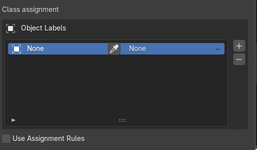
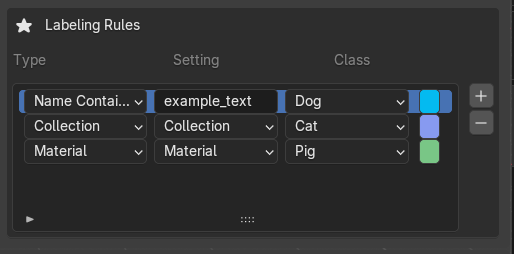
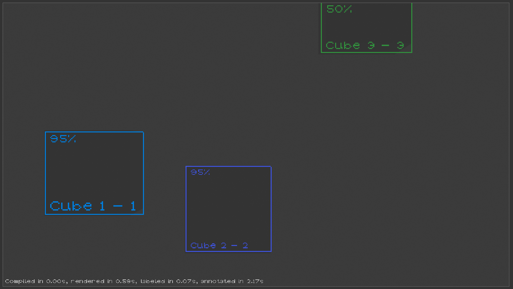

# Tutorial: Classes, Entities, and Object Classification

## Overview

In this tutorial, you'll learn how to set up a complete labeling workflow for synthetic data generation:
- Create test objects in your Blender scene
- Define custom classes for object categorization
- Organize objects into multi-object entities (optional)
- Assign classes to objects using manual rules and automated matching
- Preview the generated labels and bounding boxes

---

## Prerequisites

- Blender 3.0+ with the extension installed
- Basic familiarity with Blender's viewport and UI
If one isn't familiar with the Blender basics, a good tutorial can be found at https://www.blenderguru.com/
---

## Section 1: Creating Test Objects in the Scene

### Step 1.1: Set Up Your Scene

1. Open Blender and create a new General project
2. Delete the default cube (if present): Select it and press **X** → **Delete**
3. You now have an empty scene ready for setup

### Step 1.2: Add Three Cubes

1. Add the first cube:
   - Press **Shift+A** → **Mesh** → **Cube**
   - In the top-left, confirm placement with default settings
   - Press **G** to grab/move it along the X-axis (press **X**, then type **-3**, then **Enter**)
   - Rename it in the Outliner to `dog` (double-click the name)

2. Add the second cube:
   - Press **Shift+A** → **Mesh** → **Cube**
   - Press **G**, then **X**, then **0**, then **Enter** (place at origin)
   - Rename to `pig`

3. Add the third cube:
   - Press **Shift+A** → **Mesh** → **Cube**
   - Press **G**, then **X**, then **3**, then **Enter**
   - Rename to `cat`

**Result:** Your scene now has three cubes arranged along the X-axis with distinct names.
You can now move the camera around and press Numpad 0 to inspect the current camera view. 
This is important: the preview will use the default scene camera. 

### Step 1.3: (Optional) Add Materials to Differentiate Objects

To prepare for rule-based classification in Section 4, you can assign materials:

1. Select each of the three cubes
2. In the Shader Editor (or Material Properties panel), create a new material and pick a different color from the palette

This will be useful when we set up material-based classification rules later.

---

## Section 2: Creating and Managing Classes

### Step 2.1: Open the Labeling Panel

1. In Blender, locate the **Labeling** panel (usually in the Properties sidebar on the right)
2. Find the **Classes** section
3. You should see an empty list of classes

### Step 2.2: Create Your First Class

1. Click the **+** button to add a new class
2. A new class entry appears with default values:
   - **Name:** (editable text field)
   - **Color:** (color picker)
   - **ID:** (numeric identifier)

3. Set up the first class:
   - Change the name to `Dog`
   - Click the color swatch and choose a brown/tan color (if you want)
   - Set ID to `0` (or leave as auto-assigned)

### Step 2.3: Create Additional Classes

Repeat Step 2.2 to create two more classes:

- **Class 2:**
  - Name: `Cat`
  - Color: Gray or silver (if you want)
  - ID: `1`

- **Class 3:**
  - Name: `Pig`
  - Color: Bright blue or similar (if you want)
  - ID: `2`

### Step 2.4: Customize a Class (Optional)

1. Select a class
2. You can change its color by clicking the color swatch
3. You can change its ID by clicking the ID field and typing a new number
4. Press away or **Enter** to confirm

**Note:** You can delete a class by clicking the **–** button, but ensure there are no "dangling" class references.

---

## Section 3: Creating Multi-Object Entities

### What Are Entities?

An **entity** is a logical grouping of multiple Blender objects that represent a single conceptual object. For example:
- A human character made of: body mesh + clothes mesh + shoes mesh → single "human" entity
- A car made of: body + wheels + windows → single "car" entity

### Step 3.1: Create an Entity (Optional)

In this tutorial, we'll create a simple entity grouping two of our cubes:
Firstly, we must enable the entity creation by checking the "Define multi-object entities" checkbox. Then: 
1. Open the **Entities** section in the Labeling panel (below Classes)
2. Click the **+** button to add a new entity
3. Name it `Mega Cube`

### Step 3.2: Assign Objects to an Entity

1. In the new entity row you should see an **eyedropper** icon. This icon is a button that allows to select currently selected objects in the scene.
2. Select the two sub-cubes and then click the eyedropper icon.

**Result:** You've created an entity containing two cubes. These objects can now be classified together as a single entity, or individually as separate objects.

### Step 3.3: Understanding Object + Entity Classification

An important feature: **objects can belong to an entity AND have individual classifications**.

For example:
- Assign `Collective` the class `Pig` (representing the whole composite)
- Assign to one of the sub-cubes the class `Dog` (detecting it individually)
- Both labels will be generated in the output

This is useful for hierarchical detection tasks.

---

## Section 4: Assigning Classes to Objects

There are two approaches to assign classes: **direct assignment** and **rule-based assignment**.

### Approach A: Direct Assignment

#### Step 4.1: Open the Class Assignment Panel

1. In the Labeling panel, locate the **Class Assignment** section
2. You should see fields for:
   - **Object/Entity Selection**
   - **Assigned Class**

#### Step 4.2: Manually Assign a Class

1. Click **Create New Assignment**
2. In the **Object** field, click to select a cube from the scene or dropdown
3. In the **Class** field, select `Pig` from the class list
4. Click **Confirm** or press **Enter**

**Result:** The cube is now directly assigned to the `Pig` class.

#### Step 4.3: Assign the Remaining Objects

You are free to assign the remaining object any way you wish. 

---

### Approach B: Rule-Based Assignment

Rules allow the system to automatically classify objects based on properties without manual assignment. You can use multiple rules simultaneously.

#### Step 4.4: Open the Rules Section

1. In the Labeling panel, find the **Classification Rules** section
2. You should see buttons for different rule types: **Material**, **Name**, **Collection**

#### Step 4.5: Create a Material-Based Rule

This rule classifies objects by the materials they have:

1. Click **+ Add Material Rule**
2. A new rule entry appears with:
   - **Material Name:** (text field)
   - **Target Class:** (dropdown)

3. Fill in the rule:
   - **Material Name:** Create a new material `Classifier` , and assign it to some cube. 
   - **Target Class:** `Pig`
   - Click **Confirm**

**Effect:** Any object in the scene with the `Classifier` will automatically be classified as `Pig`.

#### Step 4.6: Create a Name-Based Rule

This rule classifies objects by substring matching in their names:

1. Click **+ Add Name Rule**
2. Fill in:
   - **Substring:** A substring which will be contained in the object's name
   - **Target Class:** `Dog`
   - Click **Confirm**

**Effect:** Any object with the substring in its name will be classified as `Dog`.

#### Step 4.7: Create a Collection-Based Rule

If you've organized objects into Blender collections, you can classify all objects in a collection:

1. In the Outliner (left side), create a new collection named `New collection`
2. Move a cube into this collection
3. In the Labeling panel, click **+ Add Collection Rule**
4. Fill in:
   - **Collection Name:** `New collection`
   - **Target Class:** `Dog`
   - Click **Confirm**

**Effect:** All objects in the `New collection` collection are classified as `Dog`.

#### Step 4.8: Rule Priority and Conflicts

If an object matches multiple rules, the extension uses this priority:
1. **Direct assignments** (highest priority)
2. **Material rules**
3. **Name rules**
4. **Collection rules** (lowest priority)

---

## Section 5: Previewing Labels and Bounding Boxes

### Step 5.1: Locate the Preview Button

1. In the Labeling panel, find the **Generator** section
2. Look for the **Preview** button, typically represented by an **eye icon** (👁)

### Step 5.2: Activate the Preview

1. Click the **eye icon** button
2. The viewport will update to show:
   - **Bounding boxes** around labeled objects (if bbox is your labeling type)
   - **Color overlays** matching your class colors
   - **Visibility estimates** (opacity or transparency levels)
   - **Object labels** with class names and IDs
   - **Statistics** related to timing 
   - 
### Step 5.4: Debug Your Setup

If an object doesn't appear in the preview:
- Check that it has a class assigned (either direct or via a rule)
- Ensure it's visible in the viewport (not hidden or on a hidden layer)
- Check the camera view—the object may be outside the camera's frustum

### Step 5.5: Adjust and Re-Preview

1. Modify class assignments, add/remove rules, or move objects in the scene
2. Click the **eye icon** again to refresh the preview
3. Iterate until you're satisfied with the labeling

---

## Common Tasks & Troubleshooting

### Task: Rename a Class After Assignment

1. In the **Classes** section, click on a class to select it
2. Change its name in the text field
3. Press **Enter** to confirm
4. All assignments referencing that class will automatically update

### Task: Remove an Object from an Entity

1. Select the entity in the **Entities** section
2. Find the sub-object list and click the **–** button next to the object
3. The object remains in the scene but is no longer part of the entity

### Troubleshooting: Object Not Appearing in Preview

- **Check visibility:** Is the object visible in the viewport? (Check outliner icons)
- **Check camera:** Is the object within the camera's view? (Use **Numpad 0** to enter camera view)
- **Check assignment:** Does the object have a class? Add a direct assignment if rules aren't matching
- **Check labeling type:** Is the preview set to show the same labeling type as your objects? (e.g., bounding box vs. polygon)

### Troubleshooting: Rule Not Matching Objects

- **Material rule:** Verify the exact material name (case-sensitive). Select the object and check the Shader Editor
- **Name rule:** The substring must match. For `cube_plastic`, substring `plastic` works; `Plastic` (capital P) may not
- **Collection rule:** Ensure the object is actually in the collection (drag it in the Outliner)

---

## Next Steps

Now that you've created classes and assigned them to objects, you can:

1. **Generate synthetic data:** Use the **Render** button to create labeled images and annotations
2. **Configure output format:** Choose between YOLO, COCO, or other formats in the extension settings
3. **Add randomization:** Vary materials, lighting, and camera angles for diverse datasets
4. **Scale up:** Add more objects, use collection-based rules for larger scenes

--

## Summary

You've learned how to:
- ✓ Create test objects in Blender
- ✓ Define custom classes with colors and IDs
- ✓ Create multi-object entities (optional feature)
- ✓ Assign classes via direct assignment
- ✓ Assign classes via material, name, and collection rules
- ✓ Preview labeled objects and bounding boxes
